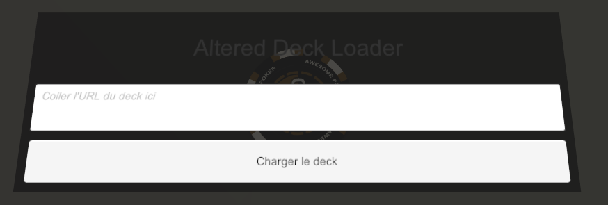

### Deck Loader

#### Création du composant et sauvegarde
Que fait-on avec le code du fichier `deck-loader.lua` ?

Alors depuis n'importe quelle table de jeu TableTopSimulator (TTS), créez un jeton de poker ou tout autre objet qui vous convient: un dé, etc.
On va lui attacher du code pour qu'apparaisse sur cet objet un formulaire pour saisir l'URL du deck et un bouton pour charger le deck devant nous.

Pour l'exemple, je prends un jeton de poker:
- Dans le menu du haut de TTS, selectionner "Objects > Components > Poker Chips"
- Glisser et déposer le jeton qui vous plait sur la table de jeu (j'ai pris un chip de 1000)
- Faites un clic droit sur le jeton et dans le menu: "Scripting > Scripting Editor"
- Ca ouvre une fenêtre, dans le menu de gauche vous verrez pré-selectionné "Chip 1000 -" suivi d'un code qui est l'identifiant de ce jeton précis.
- Cliquer dans la grande zone grise de droite et coller le contenu du fichier `deck-loader.lua` dedans.
- Vous devriez voir les barres de scrolling apparaitre autour de cette zone grise.
- Bougez les et vous devriez voir le texte du fichier
- Cliquer sur "Save & Play", ca recharge la table avec le nouveau design du poker-chip :)
- Réorienter le jeton s'il vous l'a mis de travers (touche E plusieurs fois sur mon TTS sur windows).
- Une fois bien aligné, faire un clic droit sur le poker chip et cliquer sur "Save Object"
- Nommer ce composant comme vous le souhaitez, par exemple "Deck Loader Altered" et faites "Save"

Voilà, tout est prêt, vous pourrez donc le charger dans n'importe quelle table de jeu.

#### Chargement du composant sur une table

Pour charger le composant tout juste sauvegardé dans n'importe quelle table de jeu:
- Menu du haut de TTS: "Objects > Saved Objets"
- Glisser le composant sur votre table de jeu
- c'est prêt à l'emploi.

#### Utilisation du composant
- Saisir l'url altered.gg de votre deck à charger dans le formulaire
- Cliquer sur "Charger le deck" et bouger votre curseur assez vite vers une zone non utilisée de la table de jeu
- Votre jeu peut lagger un peu, il est en train de faire ses requêtes pour récupérer les images et vous monter le deck
- Le deck va être chargé devant vous, là où votre pointeur de souris aura été bougé.

Démo (Vidéo):

#### Défaut du composant
J'ai fait ça à l'arrache, les vrais développeurs pourront modifier et fixer ce truc.

Le défaut de ce composant est que si vous gardez le pointeur de souris sur le bouton "Charger le deck", il se peut que votre deck arrive "dans" le composant et qu'il soit comme bloqué, pas déplacable.

J'ai eu la flemme de corriger ce point donc je me débrouille pour bien déplacer mon pointeur de souris dès que j'ai cliqué sur "Charger le deck".

